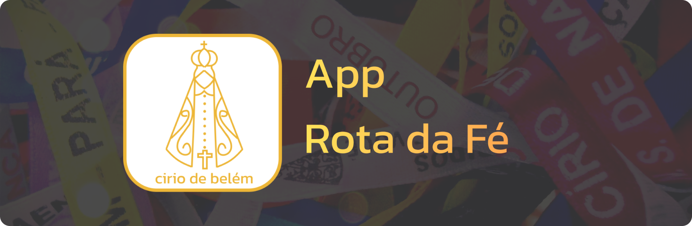

# Projeto Cirio 2024 - Aplicativo de Cadastro de Participantes - Rota da Fé

assdasd


## Acesso rapido

- [Como contribuir o projeto](#passos-para-contribuir-com-o-projeto)
- [Acesso ao Docs](/docs/)
- [Acesso ao Desing](/desing/)
- [Acesso ao front-end](/frontend/)
- [Acesso ao back-end](/backend/)


## 🚀 Nossas Iniciativas

### 📅 Projeto Cirio Rota da Fé 2024

O **Projeto Cirio Rota da Fé 2024** é nossa mais recente empreitada. Este projeto acadêmico de extensão, em parceria com o Grupo UNAMA, busca modernizar e simplificar o processo de cadastramento de participantes do Círio. Desenvolvemos um aplicativo Android que oferece uma experiência intuitiva e eficiente, com suporte para operações offline. Estamos comprometidos em tornar a experiência de fé mais acessível aa todos.

- **Tecnologias utilizadas**: Flutter, Dart, Node.js, NestJS, SQLite

## Funcionalidades Principais

O aplicativo oferece as seguintes funcionalidades principais:


### Cadastro de Participantes Offline

Os participantes podem se cadastrar mesmo sem conexão com a internet, armazenando os dados diretamente no dispositivo
Android.

### Exportação de Banco de Dados

Uma funcionalidade essencial do aplicativo é a capacidade de exportar o banco de dados SQLite para garantir que os dados
não sejam perdidos. Você pode exportar os dados para um arquivo que pode ser facilmente transferido para outro
dispositivo ou armazenado em backup.

### Tela Inicial Intuitiva

A tela inicial do aplicativo apresenta um menu de opções simplificado, proporcionando fácil navegação:

- **Consulta**: Visualize todos os cadastros de participantes realizados até o momento. Edite os cadastros facilmente
clicando na opção desejada.

- **Cadastro**: Preencha o formulário de cadastro de participante e confirme o cadastro com um simples toque.

- **Configurações**: Personalize a experiência de uso do aplicativo com opções para **editar** o perfil de usuario e
opção para **exporta** os dados para a nuvem .

Agradecemos por seu interesse no **Projeto Cirio 2024**. Juntos, podemos tornar a experiência do Cirio ainda mais
especial para todos os participantes. Vamos fazer parte dessa história!

## Passos para contribuir com o projeto

### 1. Faça o clone do projeto

Este comando ira copia de o projeto no main.

```sh
git clone git@github.com:RotaDaFe/trabalho_extensao_projeto_cirio_2024.git
```

### 2. Inicie uma branch task issue

Este comando ira criar uma branch task separada da mig como uma copia de tal, no comando abaixo certifique de trocar o
'numberIssue' pela numeração da task que voce esta tratando

```sh
git checkout -b issue-numbeIssue
```

### 3. Verifique se voce esta na branch correta

Finalizando os camando antes de realizar qualquer mudança verifique se esta na branch correta atravez do camando

```sh
git branch
```

O retorno deste comando deve ser issue-<'numero-da-sua-issue'>

**Divirta-se cadastrando e compartilhando momentos inesquecíveis no Cirio 2024!**

## Orientador

- [@Erminio Augusto Ramos da Paixao](http://lattes.cnpq.br/3441462516404507)

## Colaboradores Universitarios

<h3>Fullstack</h3>
<table>
    <tr>
        <td align="center">
            <br>
            <a href="https://github.com/marco0antonio0">@Marco Antonio</a>
        </td>
    </tr>
</table>

<h3>Frontend</h3>
<table>
    <tr>
        <td align="center">
            <br>
            <a href="#">@Mateus</a>
        </td>
        <td align="center">
            <br>
            <a href="https://github.com/FelipeMourah">@Felipe</a>
        </td>
        <td align="center">
            <br>
            <a href="#">@Iago</a>
        </td>
        <td align="center">
            <br>
            <a href="https://github.com/MatheusBarbosaDeAndrade">@Matheus Barbosa</a>
        </td>
        <td align="center">
            <br>
            <a href="https://github.com/Morceline">@Jackeline</a>
        </td>
        <td align="center">
            <br>
            <a href="#">@Tales</a>
        </td>
        <td align="center">
            <br>
            <a href="https://github.com/AlexsandroFernandesNascimento">@Alexsandro Fernandes</a>
        </td>
    </tr>
</table>

<h3>Backend</h3>

<table>
    <tr>
        <td align="center">
            <br>
            <a href="#">@Pedro Gabriel Raiol Frade</a>
        </td>
        <td align="center">
            <br>
            <a href="https://github.com/gabrielhpmaia">@Gabriel Henrique Pinheiro Maia</a>
        </td>
        <td align="center">
            <br>
            <a href="https://github.com/Arthemyo">@Arthemyo Rodrigues</a>
        </td>
        <td align="center">
            <br>
            <a href="https://github.com/meloeduardo">@Paulo Eduardo Melo Pereira</a>
        </td>
    </tr>
</table>

<h3>Design e documentação</h3>

<table>
    <tr>
        <td align="center">
            <br>
            <a href="#">@salomão trindade</a>
        </td>
        <td align="center">
            <br>
            <a href="#">@Iago Weycker</a>
        </td>
        <td align="center">
            <br>
            <a href="https://github.com/melizerocha">@Melize Rocha</a>
        </td>
    </tr>
</table>

